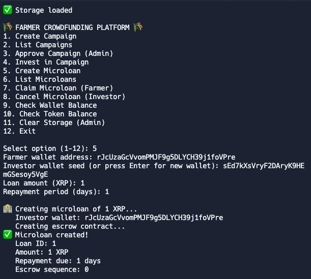

# AgriVest: Empowering Small Farmers with Global Investment

AgriVest tackles the critical underfunding of smallholder farmers in emerging economies. These farmers are the backbone of food security, yet billions struggle daily with insufficient access to financial resources. Our app provides a direct solution by connecting these vital agricultural producers with a global community of investors.

## What AgriVest Does
AgriVest serves as a transparent and efficient bridge, allowing people worldwide to invest directly in specific farming projects.

* Project Vetting & Onboarding: Farmers, aided by local partners, submit detailed project proposals. Our team conducts thorough due diligence to verify and approve projects.
* Global Investment Portal: Investors can browse vetted projects with clear details, financial projections, and impact metrics. They can choose from flexible investment tiers.
* Secure Funding & Disbursement: Funds are pooled and disbursed to farmers in phases, tied to verified project milestones.
* Harvest & Returns: Upon successful harvest and sale, profits are shared with investors, and a portion is reinvested.

## How AgriVest Leverages the XRP Ledger (XRPL)
The XRP Ledger is crucial for AgriVest's efficiency, transparency, and global reach:

* Transparent & Efficient Fund Transfers: XRPL's speed and low fees enable near-instant, cost-effective cross-border investments and phased disbursements to farmers. Returns are also distributed efficiently via XRPL.
* Stablecoin Integration: We leverage stablecoins issued on XRPL for price stability, protecting both farmers and investors from crypto volatility.
* Transparency and Immutability: Every transaction is recorded on the public and immutable XRPL, providing an unalterable audit trail and building trust.
* Scalability: XRPL's high transaction capacity ensures AgriVest can scale effectively as more projects and investors join.

## Impact
AgriVest is more than an app; it's a commitment to empowering smallholder farmers. By providing direct capital, promoting transparency, and fostering sustainable practices, we aim to:

* Reduce poverty in farming communities.
* Enhance global food security.
* Drive economic growth and financial inclusion.
* AgriVest cultivates a future where smallholder farmers thrive, transforming the landscape of agricultural finance one investment at a time.

## Screenshots

